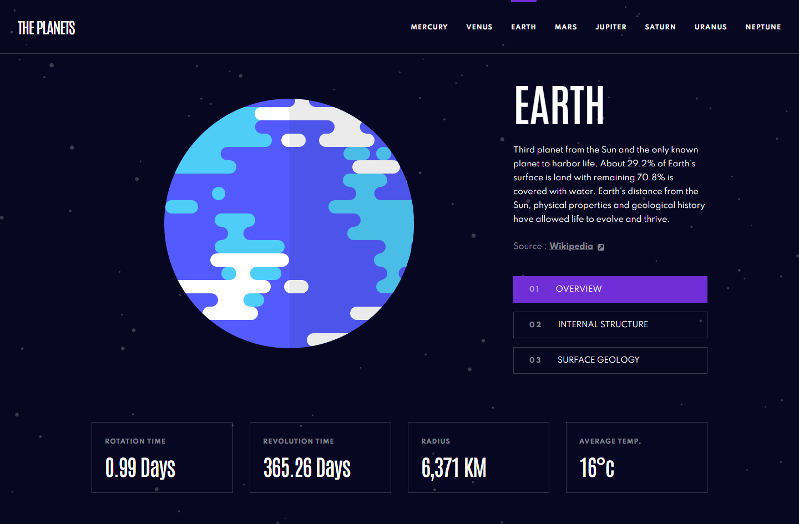

# Planets Facts

This repository showcases my solution to the [Planets facts challenge on Frontend Mentor](https://www.frontendmentor.io/challenges/planets-fact-site-gazqN8w_f). Frontend Mentor challenges have been instrumental in honing my coding skills by providing real-world projects.

## Overview

### The Challenge

Users should be able to:

- View the optimal layout for the app depending on their device's screen size.
- See hover states for all interactive elements on the page.
- View each planet page and toggle between "Overview", "Internal Structure", and "Surface Geology".

### Preview

## Links

- **Live Site:** [Vercel](https://planets-facts-rgomes98.vercel.app/)
- **Solution:** [Frontend Mentor](https://www.frontendmentor.io/solutions/planets-facts-site-solution-BtpbgwQ7p-)

## My Process

### Built With

- SASS.
- Figma.
- React.js.
- TypeScript.

## Continued Development

For future projects, I plan to delve deeper into:

- Exploring advanced SASS features for more efficient styling.
- Mastering TypeScript for enhanced type safety and better code organization.

## Acknowledgments

A big shoutout to the Frontend Mentor community for providing challenging projects and fostering a collaborative learning environment.
